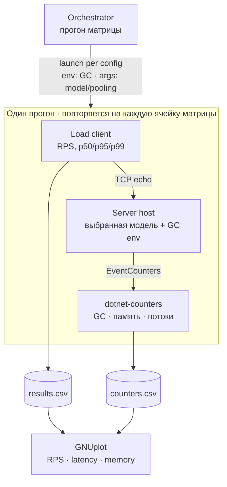

# Архитектура: High-load TCP echo benchmark (.NET)

Стенд для честного сравнения моделей TCP-сервера под высокой нагрузкой. Одна и та же
тривиальная задача (эхо: принял байты — отдал те же байты) решается двумя моделями
конкуренции, и каждая замеряется по пропускной способности, латентности и поведению
памяти/GC.

---

## 1. Цель и вопрос

Центральный вопрос: **как обслуживать тысячи одновременных соединений и какая модель
конкуренции лучше держит нагрузку** — блокирующая (поток на соединение) против
асинхронной (epoll-цикл). Эхо-сервер выбран намеренно: он не содержит бизнес-логики,
поэтому единственной значимой переменной остаётся сама модель работы с соединениями.
Это контролируемый эксперимент, а не приложение.

---

## 2. Сравниваемые модели

| Модель | Суть | Аналог в C++/Boost.Asio |
|---|---|---|
| `ThreadPerConnection` | блокирующий accept + поток на соединение, `Read`/`Write` | `accept()` + `std::thread` |
| `Async` | `async/await` поверх сокетов, масштабируется ThreadPool'ом | `io_context` + `async_read/write` |

В .NET `async/await` поверх сокетов на Linux уже работает через epoll-цикл рантайма
(`SocketAsyncEngine`), поэтому отдельной «настройки epoll», как в Boost, здесь нет —
масштабируемая модель достаётся из коробки.

---

## 3. Матрица эксперимента

Сравнение идёт не по одной оси, а по полной матрице независимых переменных:

| Ось | Значения |
|---|---|
| Модель | ThreadPerConnection · Async |
| Режим GC | Workstation/Server × Concurrent(Background)/Blocking |
| Пулинг буферов | `ArrayPool<byte>` против `new byte[]` |
| Нагрузка | число соединений, длительность, размер payload |

Каждая ячейка матрицы — отдельный прогон с собственной строкой результата.

---

## 4. Ключевые ограничения (почему архитектура именно такая)

1. **Режим GC фиксируется на старте процесса** — переключить Workstation↔Server в рантайме
   нельзя. Следствие: каждая ячейка матрицы запускается **отдельным процессом**, которому
   оркестратор выставляет `DOTNET_gcServer` / `DOTNET_gcConcurrent` через переменные
   окружения.
2. **Метрики снимаются вне процесса сервера.** Измерять GC изнутри — значит самому
   аллоцировать и искажать ту самую картину, которую изучаешь (эффект наблюдателя).
   Поэтому счётчики собирает внешний `dotnet-counters`, прицепленный к PID.
3. **Изоляция прогонов.** Свежий процесс на каждую ячейку плюс пауза между прогонами —
   чтобы прогрев JIT и состояние GC из предыдущего прогона не протекали в следующий.

---

## 5. Раскладка решения

```
HighLoadEchoBench.sln
├─ src/
│  ├─ EchoBench.Abstractions/   контракты: IEchoServer, ServerConfig, IBufferStrategy
│  ├─ EchoBench.Servers/        2 реализации модели + фабрика
│  ├─ EchoBench.Host/           консольный хост: читает конфиг, поднимает сервер, отдаёт счётчики
│  ├─ EchoBench.LoadClient/     TCP-нагрузчик + HdrHistogram
│  └─ EchoBench.Orchestrator/   прогон матрицы экспериментов
├─ bench/
│  ├─ plots/                    .gp скрипты GNUplot
│  └─ results/                  выходные CSV
└─ docs/
   ├─ ARCHITECTURE.md           этот файл
   └─ STRUCTURE.md              структура проекта вплоть до файлов
```

---

## 6. Контракты (EchoBench.Abstractions)

Один общий контракт делает модели взаимозаменяемыми: хост выбирает реализацию по конфигу,
а нагрузчик и метрики не знают, какая модель крутится под ними.

```csharp
public interface IEchoServer : IAsyncDisposable
{
    Task RunAsync(CancellationToken ct);   // принимает соединения до отмены
}

public enum ServerModel { ThreadPerConnection, Async }

public sealed record ServerConfig
{
    public ServerModel Model { get; init; }
    public int Port { get; init; } = 9000;
    public int Backlog { get; init; } = 1024;
    public int BufferSize { get; init; } = 4096;
    public bool UseBufferPool { get; init; } = true;   // ArrayPool vs new[]
    public bool NoDelay { get; init; } = true;
}
```

Пулинг буферов вынесен в стратегию, чтобы переключать его как параметр прогона, а не
через `#if`:

```csharp
public interface IBufferStrategy
{
    byte[] Rent(int size);
    void Return(byte[] buffer);
}
// PooledBufferStrategy → ArrayPool<byte>.Shared.Rent/Return
// PlainBufferStrategy  → new byte[size]; Return — пустой
```

---

## 7. Компоненты

### Servers
Два класса, реализующие `IEchoServer`, с общей формой accept-цикла, но разной моделью
конкуренции: `ThreadPerConnection` (блокирующий, поток на соединение) и `Async`
(async/await, epoll-цикл рантайма). Фабрика `EchoServerFactory.Create(config, bufferStrategy)`
отдаёт нужную по `config.Model`; `IBufferStrategy` инжектится в конструктор — отсюда чистый
тумблер пулинга.

### Host
Тонкий консольный entry point. Читает `ServerConfig` из аргументов CLI (модель, порт,
пулинг, размер буфера); режим GC берёт из переменных окружения, выставленных оркестратором.
Собирает сервер через фабрику, заводит `Meter` (`System.Diagnostics.Metrics`) с прикладными
счётчиками (соединения, прокачанные байты), сигналит готовность (`READY` + открытый порт) и
аккуратно гасится по отмене. Один процесс = одна ячейка матрицы.

### LoadClient
Открывает N соединений; на каждом — замкнутый цикл: отправить фиксированный payload,
дочитать ровно столько же байт эха, записать round-trip в HdrHistogram, повторять заданное
время. Прогрев отбрасывается; перцентили считаются из слитых гистограмм, RPS = общее число
запросов / длительность. Альтернатива — внешний `tcpkali`.

### Orchestrator
Сердце стенда. Для каждой ячейки матрицы {модель × режим GC × пулинг}:

1. поднять `Host` дочерним процессом с env (`DOTNET_gcServer` / `DOTNET_gcConcurrent`) и
   аргументами (модель, пулинг, порт);
2. дождаться `READY` (поллинг порта);
3. прицепить `dotnet-counters collect --process-id <pid>` → `counters.csv`;
4. прогнать `LoadClient` (или `tcpkali`) → строка результата;
5. опционально снять `dotnet-gcdump` на пике;
6. убить `Host`, выдержать паузу (порты дренируются, GC устаканивается);
7. дописать строку в `results.csv` со всеми переменными и метриками.

После цикла — вызвать GNUplot.

### Metrics pipeline
Два источника. Клиентский: RPS и перцентили латентности. Серверный: счётчики
`System.Runtime` (число сборок Gen0/1/2, % времени в GC, длительность пауз, working set,
allocation rate, число потоков пула), снимаемые вне процесса через `dotnet-counters`. На
пике — снимок кучи `dotnet-gcdump`.

---

## 8. Поток данных



---

## 9. Формат результатов

Один CSV, строка на прогон — все независимые переменные плюс все метрики:

```
model, gc_server, gc_concurrent, pooled, conns, dur_s,
rps, p50_us, p95_us, p99_us, p999_us,
gen0, gen1, gen2, gc_pause_ms, ws_mb, alloc_mbps, threads
```

GNUplot-скрипты строят по нему ключевые графики:
- RPS по моделям, сгруппированный по режиму GC;
- перцентили латентности по моделям;
- флагманский «working set от числа соединений»;
- allocation rate «пул против без пула».

---

## 10. Методологические оговорки

- **Coordinated omission.** Замкнутый цикл нагрузчика (ждём ответ перед следующим запросом)
  занижает хвост латентности под нагрузкой. Лечится записью с ожидаемым интервалом в
  HdrHistogram, open-loop-моделью либо использованием `tcpkali`.
- **CPU-изоляция.** Клиент должен жить на отдельных ядрах или отдельной машине от сервера,
  иначе ворует у него CPU и искажает цифры (`taskset`/affinity или вторая машина).
- **Прогрев и пауза.** Начальный прогрев (JIT) отбрасывается; между прогонами выдерживается
  пауза, чтобы порты дренировались, а GC устаканивался.
- **wrk не подходит** для raw-TCP — он говорит по HTTP. Используется `tcpkali` или
  собственный `LoadClient`.

---

## 11. Ключевые решения (сводка)

- Процесс-на-ячейку — режим GC фиксируется на старте.
- Метрики вне процесса — чтобы не словить эффект наблюдателя.
- Отбрасывание прогрева + пауза между прогонами — изоляция JIT/GC.
- Клиент на отдельных ядрах — без борьбы за CPU.
- Стратегия буфера через инъекцию — чистый тумблер пулинга.
- Коррекция coordinated omission — честный хвост латентности.
- Единый контракт `IEchoServer` — модели сравниваются «яблоки к яблокам».

---

## 12. Среда и команды

Среда: **.NET 10, Linux** (epoll, `dotnet-counters`, `tcpkali`, `gnuplot`).

```bash
# сборка
dotnet build

# запуск одного сервера вручную (для отладки)
DOTNET_gcServer=1 DOTNET_gcConcurrent=1 \
  dotnet run -c Release --project src/EchoBench.Host -- --model Async --pooled true --port 9000

# полный прогон матрицы
dotnet run -c Release --project src/EchoBench.Orchestrator

# инструменты метрик (ставятся как global tools)
dotnet tool install -g dotnet-counters
dotnet tool install -g dotnet-gcdump
```

---

## 13. Порядок сборки (walking skeleton)

Строить вертикальный срез, а не вширь:

1. Контракты в `Abstractions`.
2. `Async`-сервер + минимальный `Host`, который реально поднимается и эхо-ит.
3. Минимальный `LoadClient`: payload → эхо → RTT. **Доказать, что петля работает end-to-end.**
4. Вторая модель — `ThreadPerConnection` — за тем же `IEchoServer`.
5. Тумблер пулинга через `IBufferStrategy`.
6. Метрики: `Meter` в хосте + сбор `dotnet-counters` в оркестраторе.
7. Оркестратор: прогон полной матрицы, запись CSV.
8. GNUplot-скрипты.

Сначала рабочий скелет, потом ширина и метрики — чтобы не построить обе модели и не
обнаружить, что обвязка сломана.

---

## 14. Справочник понятий

- **epoll** — механизм ядра Linux, позволяющий одному потоку эффективно отслеживать тысячи
  соединений и получать только готовые. Фундамент масштабируемой (async) модели.
- **Режимы GC** — две независимые оси: Workstation (одна куча) против Server (куча и поток
  GC на ядро, выше throughput, больше памяти) и Background/concurrent против blocking
  (длина stop-the-world пауз). Под высокой конкуренцией Server обычно сильно выигрывает.
- **Пулинг буферов** — переиспользование заранее выделенных массивов вместо аллокации
  нового под каждое чтение; резко снижает allocation rate и давление на GC.
- **Gen0** — нулевое поколение GC, «ясли» для новорождённых объектов. Собирается часто и
  дёшево; высокий allocation rate забивает его и плодит частые сборки. Здоровый сервер:
  почти всё умирает в Gen0 и не повышается в Gen2.
